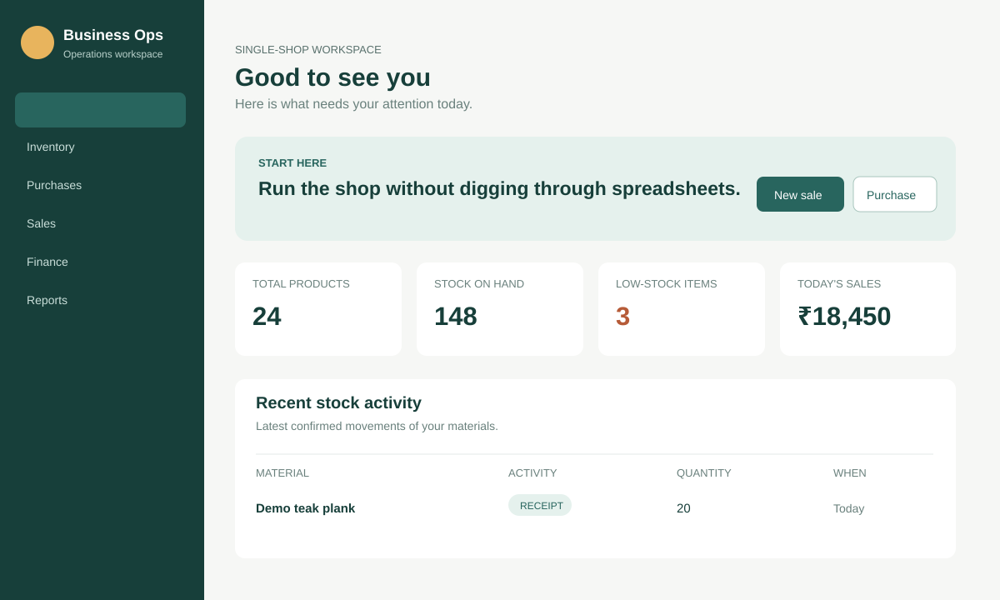
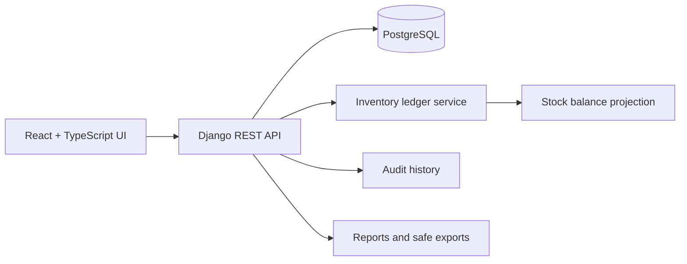

# Business Operations Workspace — Product & Engineering Showcase

> A sanitized public case study of a private, local-first operations platform for a single-location materials business.

This repository documents the private project’s product design and engineering approach without publishing its working source code, data, credentials, business identity, or deployment configuration.

## The problem

Small operational businesses commonly run stock, purchasing, sales, customer records, expenses, and delivery through separate notebooks or spreadsheets. This project brings those workflows together in a clear, role-aware web application that remains approachable for non-technical staff.

## Product scope

- Guided first-time setup: material → purchase → confirmed stock → sale.
- Draft-first purchases and sales: stock changes only after an intentional real-world confirmation.
- Inline supplier/customer creation during transaction entry.
- Inventory, purchasing, sales, finance, quotes, delivery, reporting, and audit history.
- Role-aware access, account/profile controls, business-data export, and inactivity-aware sessions.
- Compact, task-oriented screens with clear next-step language.

## System architecture

The inventory model is confirmation-driven: incoming goods increase stock only when a purchase is confirmed, and dispatched goods reduce stock only when a sale is confirmed. An immutable ledger preserves the operational record; a balance projection provides fast UI reads.

## Infrastructure and production-minded engineering

The private project is containerized with Docker Compose:

| Service | Role |
|---|---|
| PostgreSQL 16 | Durable transactional data store with a health check and named volume |
| Django REST API | Migrations, authentication, authorization, business rules, and reporting |
| React/Vite web client | Type-checked production build served as the local web application |

The implementation uses environment-driven configuration, separate database credentials, Docker health checks, automatic migrations at API startup, data volumes, a dedicated `.env.example`, and ignore rules that prevent secrets, local data, exports, dependencies, and build output from entering version control.

See [infrastructure notes](docs/INFRASTRUCTURE.md) and [security/operations notes](docs/SECURITY_AND_OPERATIONS.md) for the complete sanitized engineering summary.

## What is public here

- [Feature and workflow story](docs/FEATURES.md)
- [Demo walkthrough](docs/DEMO_WALKTHROUGH.md)
- [Infrastructure and local runtime](docs/INFRASTRUCTURE.md)
- [Security and operations model](docs/SECURITY_AND_OPERATIONS.md)
- [Publication boundaries](docs/PUBLICATION_BOUNDARIES.md)
- [Illustrative stock-confirmation sample](samples/confirmTransaction.ts)

## What is intentionally excluded

- Full private application source and internal configuration.
- Business identity, customer/supplier/staff information, invoices, and financial records.
- Database files, migrations containing live data, exports, backups, and Docker volumes.
- Environment files, secrets, credentials, and deployment addresses.

## Portfolio note

This is a private-business implementation presented as a product and engineering case study. It is intentionally non-deployable; the full working code remains private.
