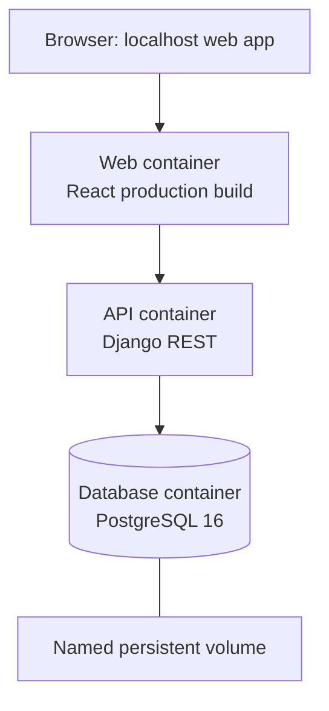

# Infrastructure and Local Runtime

## Container topology

The private system is run locally through Docker Compose. The architecture intentionally separates the client, API, and database so the same boundaries can be carried into a hosted deployment.



## Services

### Database

- PostgreSQL 16 runs in a dedicated container.
- A health check prevents dependent services from starting before the database is ready.
- A named volume keeps business data when app containers are stopped or recreated.

### API

- Django REST Framework provides authenticated endpoints, validation, business rules, and migrations.
- The API startup sequence applies migrations before serving requests.
- Configuration is supplied through environment variables rather than committed secrets.

### Web client

- The UI is built with React, TypeScript, and Vite.
- Type checking and the production build are run before release verification.
- The client talks only to the local authenticated API.

## Local developer commands

```powershell
# Start services
docker compose up -d

# Check backend integrity
docker compose exec -T api python manage.py check

# Build the frontend
Set-Location frontend
npm run build

# Stop safely while preserving data
docker compose stop
```

`docker compose down -v` is deliberately avoided in normal operation because it removes the database volume.

## Configuration boundaries

The implementation uses a non-committed `.env` file for credentials and runtime settings, with a safe `.env.example` file for setup. Git ignore rules exclude local databases, build artifacts, exports, backups, dependencies, and secret files.
